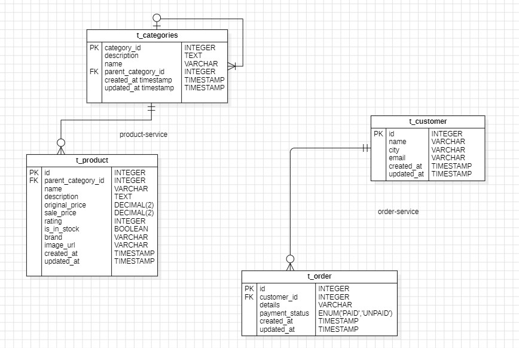

Currently, there are 4 microservices, each has its own build.gradle to declare its dependencies. `order-service` calls `product-service` for product details.



Some API to ping:

```bash
Post /api/product
    request body {
        String name
        String description
        Double price
        Long parentCategoryId
    }
Delete /api/product/{id}
Get /api/product/all

Get /api/categories
Get /api/categories/hierarchical
Get /api/categories/{categoryId}/products

Post /api/order
    request body {
        Long customerId
        String orderDetails
    }
Get /api/order/{id}
Get /api/order/allproducts

Get /api/cart/{id}
Post /api/cart/addItem
```

Similar result can be found at `<service>/v3/api-docs`

Key highlight:

- `Get /api/order/allproducts` fetches from the `product-service` module, using eureka for client discovery and HttpClient to make Http Get request for all products, show casing cross module communication.

View the project in minified view:

```bash
.
|-- api-gateway
|   |-- src
|   |   `-- main
|   |       |-- java
|   |       |   `-- com
|   |       |       `-- shoeshop
|   |       |           |-- domain
|   |       |           |   `-- member
|   |       |           |       `-- controller
|   |       |           |           `-- MemberController.java
|   |       |           |-- exception
|   |       |           |   `-- ExceptionAdvice.java
|   |       |           |-- filter
|   |       |           |   `-- LoggingFilter.java
|   |       |           |-- response
|   |       |           |   |-- BaseResponse.java
|   |       |           |   |-- FailureInfo.java
|   |       |           |   `-- SuccessInfo.java
|   |       |           |-- ApiGatewayApp.java
|   |       |           `-- Result.java
|   |       `-- resources
|   |           |-- application-prod.yml
|   |           `-- application.yml
|   |-- Dockerfile
|   `-- build.gradle
|-- eureka-service
|   |-- src
|   |   `-- main
|   |       |-- java
|   |       |   `-- com
|   |       |       `-- shoeshop
|   |       |           `-- EurekaApp.java
|   |       `-- resources
|   |           |-- application-prod.yml
|   |           `-- application.yml
|   |-- Dockerfile
|   `-- build.gradle
|-- frontend-client
|   `-- shoe-shop
|       |-- src
|       |   |-- app
|       |   |   |-- core
|       |   |   |   |-- network
|       |   |   |   |   `-- Interceptor.ts
|       |   |   |   |-- service
|       |   |   |   |   `-- LoadingService.ts
|       |   |   |   `-- store
|       |   |   |       `-- category.store.ts
|       |   |   |-- feature
|       |   |   |   |-- category-list
|       |   |   |   |   |-- components
|       |   |   |   |   |   |-- category-item
|       |   |   |   |   |   |   |-- category-item.component.html
|       |   |   |   |   |   |   |-- category-item.component.scss
|       |   |   |   |   |   |   |-- category-item.component.spec.ts
|       |   |   |   |   |   |   `-- category-item.component.ts
|       |   |   |   |   |   |-- category-list
|       |   |   |   |   |   |   |-- category-list.component.html
|       |   |   |   |   |   |   |-- category-list.component.scss
|       |   |   |   |   |   |   |-- category-list.component.spec.ts
|       |   |   |   |   |   |   `-- category-list.component.ts
|       |   |   |   |   |   `-- interfaces
|       |   |   |   |   |       |-- CategoryNode.ts
|       |   |   |   |   |       `-- Product.ts
|       |   |   |   |   |-- services
|       |   |   |   |   |   |-- category.service.spec.ts
|       |   |   |   |   |   `-- category.service.ts
|       |   |   |   |   |-- category-list-routing.module.ts
|       |   |   |   |   `-- category-list.module.ts
|       |   |   |   `-- product-list
|       |   |   |       |-- components
|       |   |   |       |   |-- product-item
|       |   |   |       |   |   |-- product-item.component.html
|       |   |   |       |   |   |-- product-item.component.scss
|       |   |   |       |   |   |-- product-item.component.spec.ts
|       |   |   |       |   |   `-- product-item.component.ts
|       |   |   |       |   `-- product-list
|       |   |   |       |       |-- product-list.component.html
|       |   |   |       |       |-- product-list.component.scss
|       |   |   |       |       |-- product-list.component.spec.ts
|       |   |   |       |       `-- product-list.component.ts
|       |   |   |       |-- services
|       |   |   |       |   |-- product.service.spec.ts
|       |   |   |       |   `-- product.service.ts
|       |   |   |       |-- product-list-routing.module.ts
|       |   |   |       `-- product-list.module.ts
|       |   |   |-- shared
|       |   |   |   |-- components
|       |   |   |   |   `-- loading
|       |   |   |   |       |-- loading.component.html
|       |   |   |   |       |-- loading.component.scss
|       |   |   |   |       |-- loading.component.spec.ts
|       |   |   |   |       `-- loading.component.ts
|       |   |   |   `-- interfaces.ts
|       |   |   |-- app-routing.module.ts
|       |   |   |-- app.component.html
|       |   |   |-- app.component.scss
|       |   |   |-- app.component.spec.ts
|       |   |   |-- app.component.ts
|       |   |   `-- app.module.ts
|       |   |-- assets
|       |   |-- environments
|       |   |   |-- environment.development.ts
|       |   |   |-- environment.production.ts
|       |   |   `-- environment.ts
|       |   |-- favicon.ico
|       |   |-- index.html
|       |   |-- main.ts
|       |   `-- styles.scss
|       |-- README.md
|       |-- angular.json
|       |-- notes.md
|       |-- package.json
|       |-- tsconfig.app.json
|       |-- tsconfig.json
|       |-- tsconfig.spec.json
|       `-- yarn.lock
|-- gradle
|   `-- wrapper
|       |-- gradle-wrapper.jar
|       `-- gradle-wrapper.properties
|-- order-service
|   |-- src
|   |   `-- main
|   |       |-- java
|   |       |   `-- com
|   |       |       `-- shoeshop
|   |       |           |-- config
|   |       |           |   |-- CurrentEnvironment.java
|   |       |           |   `-- ProductServiceEndpointProperties.java
|   |       |           |-- controller
|   |       |           |   |-- CartController.java
|   |       |           |   |-- CustomerController.java
|   |       |           |   `-- OrderController.java
|   |       |           |-- dto
|   |       |           |   |-- CartCreateDto.java
|   |       |           |   |-- CartDto.java
|   |       |           |   |-- CartItemDto.java
|   |       |           |   |-- CustomerDto.java
|   |       |           |   |-- OrderCreateDto.java
|   |       |           |   `-- OrderDto.java
|   |       |           |-- entity
|   |       |           |   |-- Cart.java
|   |       |           |   |-- CartItem.java
|   |       |           |   |-- Customer.java
|   |       |           |   `-- Order.java
|   |       |           |-- enums
|   |       |           |   `-- PaymentStatus.java
|   |       |           |-- exceptions
|   |       |           |   |-- EntityNotFoundException.java
|   |       |           |   |-- ExceptionAdvice.java
|   |       |           |   `-- GlobalException.java
|   |       |           |-- repository
|   |       |           |   |-- CartItemRepository.java
|   |       |           |   |-- CartRepository.java
|   |       |           |   |-- CustomerRepository.java
|   |       |           |   `-- OrderRepository.java
|   |       |           |-- response
|   |       |           |   |-- APIResponseWrapperForJsonParsing.java
|   |       |           |   |-- BaseResponse.java
|   |       |           |   |-- DataResponse.java
|   |       |           |   |-- FailureInfo.java
|   |       |           |   `-- SuccessInfo.java
|   |       |           |-- service
|   |       |           |   |-- CartService.java
|   |       |           |   |-- CustomerService.java
|   |       |           |   |-- OrderService.java
|   |       |           |   `-- ProductServiceClient.java
|   |       |           |-- AuditEntity.java
|   |       |           `-- OrderApp.java
|   |       `-- resources
|   |           |-- application-prod.yml
|   |           |-- application.yml
|   |           |-- product-service-api.json
|   |           `-- sql-init.sql
|   |-- Dockerfile
|   |-- build.gradle
|   `-- fetchApi.sh
|-- product-service
|   |-- src
|   |   `-- main
|   |       |-- java
|   |       |   `-- com
|   |       |       `-- shoeshop
|   |       |           |-- config
|   |       |           |   `-- WebConfig.java
|   |       |           |-- controller
|   |       |           |   |-- CategoryController.java
|   |       |           |   `-- ProductController.java
|   |       |           |-- dto
|   |       |           |   |-- CategoryDto.java
|   |       |           |   |-- CategoryNode.java
|   |       |           |   |-- ProductCreateDto.java
|   |       |           |   `-- ProductDto.java
|   |       |           |-- entity
|   |       |           |   |-- Category.java
|   |       |           |   `-- Product.java
|   |       |           |-- exceptions
|   |       |           |   |-- EntityNotFoundException.java
|   |       |           |   `-- ExceptionAdvice.java
|   |       |           |-- repository
|   |       |           |   |-- CategoryRepository.java
|   |       |           |   `-- ProductRepository.java
|   |       |           |-- response
|   |       |           |   |-- BaseResponse.java
|   |       |           |   |-- DataResponse.java
|   |       |           |   |-- FailureInfo.java
|   |       |           |   `-- SuccessInfo.java
|   |       |           |-- service
|   |       |           |   |-- CategoryService.java
|   |       |           |   `-- ProductService.java
|   |       |           `-- ProductApp.java
|   |       `-- resources
|   |           |-- application-prod.yml
|   |           |-- application.yml
|   |           `-- sql-init.sql
|   |-- Dockerfile
|   `-- build.gradle
|-- README.md
|-- build.gradle
|-- docker-compose.yml
|-- gradlew
|-- gradlew.bat
|-- settings.gradle
`-- this.code-workspace

78 directories, 147 files

```