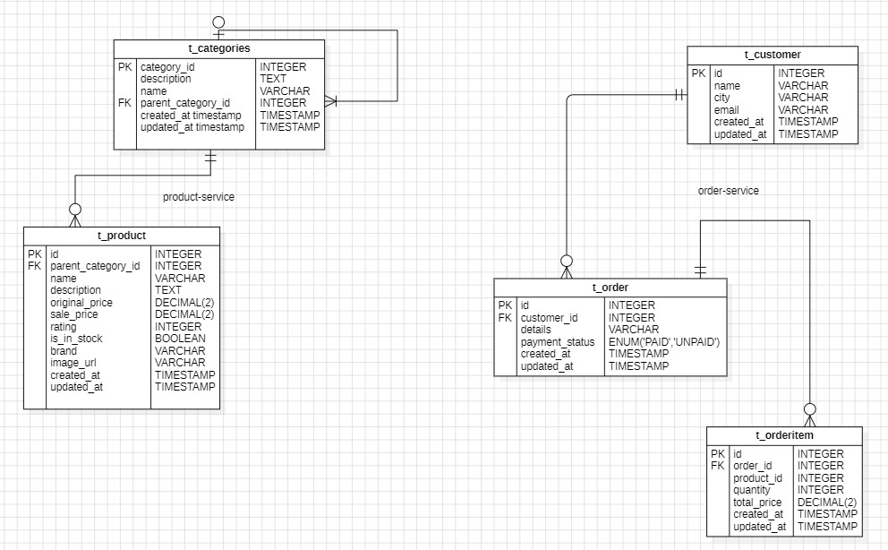
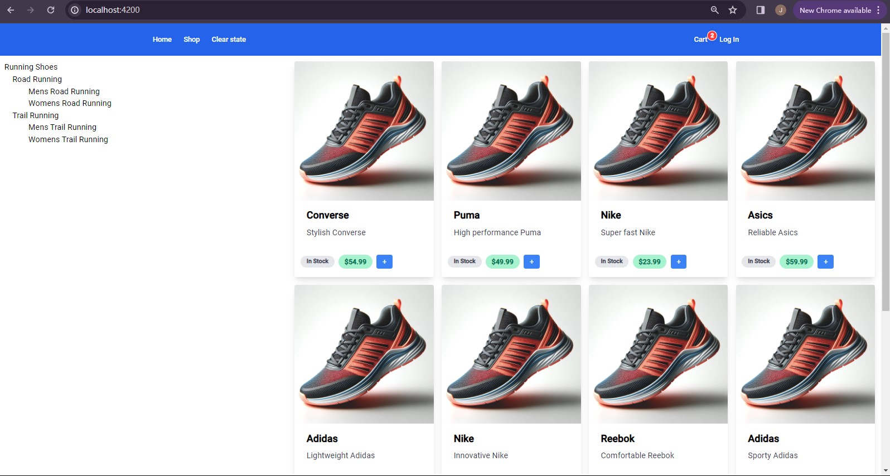
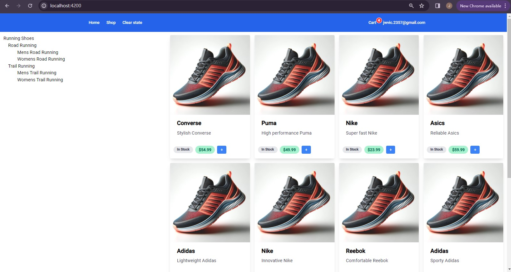
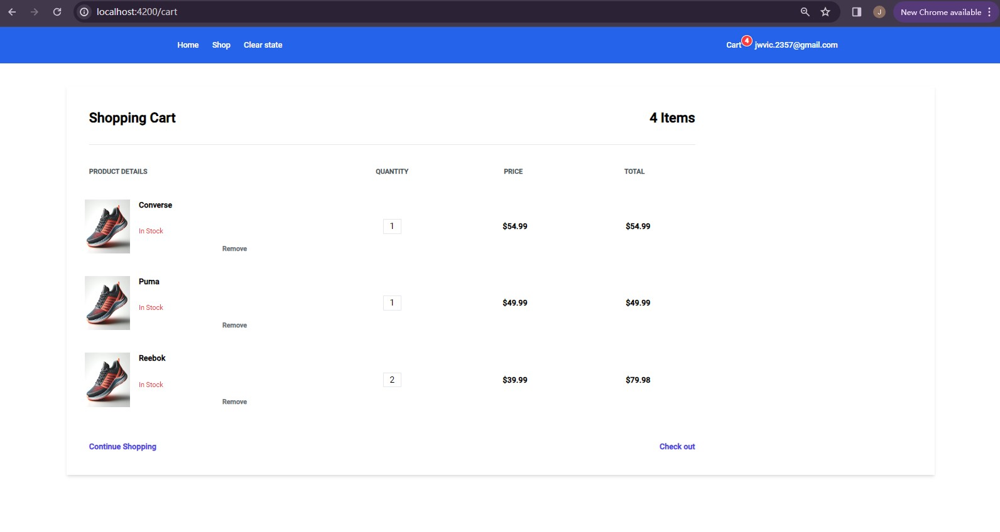
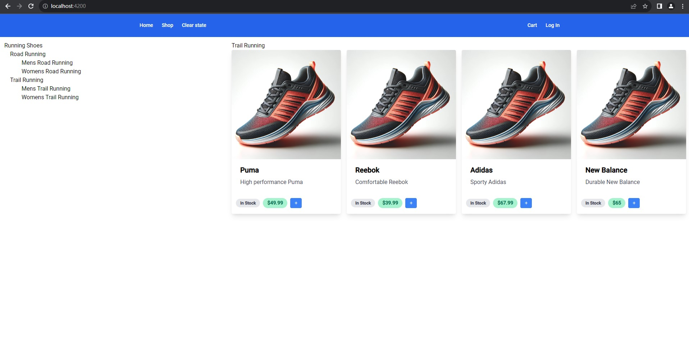
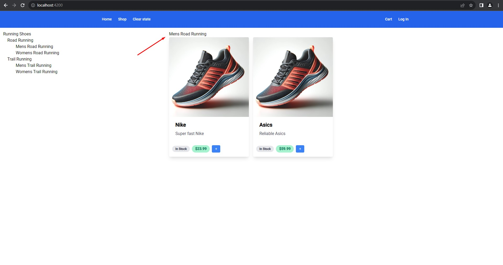

# Shoe-Shop Project

## Overview of Project
This document serves as the technical documentation for the Shoe-Shop Project. The project is developed using Spring Boot 3 and Java 17, providing a simulation of a microservices architecture. It is intended to exemplify a scalable, robust system using current best practices in microservices development.

## Functional Specifications
- **Cross-Module Communication**: The project demonstrates cross-module communication with features such as `Get /api/order/allproducts`.
- **Exception Handling**: Implements a unified approach to exception handling across services.
- **Database Design**: The Category table features a self-join, allowing a product to belong to a primary category and a subcategory simultaneously. Selecting a category returns all related products.

### Future Development Objectives
- **API Gateway Integration**: Implementing an API Gateway for module interactions.
- **Database Upgrade**: Transitioning from an in-memory H2 database to a remote database system.
- **Frontend and API Gateway Interaction**: Enabling the frontend to interact with the API Gateway.
- **Inventory Module Implementation**: Adding an inventory module with Eureka integration for order processing.
- **Billing Module Integration**: Incorporating a billing module subscribing to new order events via RabbitMQ.
- **Checkout Feature Completion**: Finalizing the checkout functionality.
- **Promo Code**: Validate promo code against backend permitted values.

### Microservices Architecture
- **Order Service**: Port 8081 - Manages customer orders.
- **Product Service**: Port 8082 - Manages product details.
- **Inventory Service**: Port 8083 - Manages inventory details.
- **API Gateway**: Port 8090 - Serves as the central entry point.
- **Eureka Service**: Port 8091 - Provides service discovery.
- **Auth Service**: Port 8092 - Handles user authentication.

### Inter-Service Communication
- [See ProductServiceClient in order-service](./order-service/src/main/java/com/shoeshop/service/ProductServiceClient.java)

## Project Setup
- The `auth-service` reads from environment variable `GOOGLE_OAUTH_CLIENT_ID` and `GOOGLE_OAUTH_CLIENT_SECRET`, see [auth-service application.yml](./auth-service/src/main/resources/application.yml), be sure to get them ready before spinning up `auth-service`.
- Just import the project into IntelliJ, or VSCode

## API Endpoints
Overview of the available API endpoints.

### Order Service APIs
```bash
Post /api/order
    request body {
        Long customerId
        String orderDetails
    }
Get /api/order/{id}
Get /api/order/allproducts

Post /api/order/addItem
    request body {
        Long orderId
        Long productId
        Long quantity
        BigDecimal totalPrice
    }
```

### Product Service APIs
```bash
Post /api/product
    request body {
        String name
        String description
        Double price
        Long parentCategoryId
    }
Delete /api/product/{id}
Get /api/product/all

Get /api/categories
Get /api/categories/hierarchical
Get /api/categories/{categoryId}/products
```

## Code Structure
Minified view of the project's directory and file structure, highlighting key components in each microservice.

### Product Service Structure
- Key components of the Product Service.

```bash
./product-service
|-- src
|   `-- main
|       |-- java
|       |   `-- com
|       |       `-- shoeshop
|       |           |-- config
|       |           |   `-- WebConfig.java
|       |           |-- controller
|       |           |   |-- CategoryController.java
|       |           |   `-- ProductController.java
|       |           |-- dto
|       |           |   |-- CategoryDto.java
|       |           |   |-- CategoryNode.java
|       |           |   |-- ProductCreateDto.java
|       |           |   `-- ProductDto.java
|       |           |-- entity
|       |           |   |-- Category.java
|       |           |   `-- Product.java
|       |           |-- exceptions
|       |           |   |-- EntityNotFoundException.java
|       |           |   `-- ExceptionAdvice.java
|       |           |-- repository
|       |           |   |-- CategoryRepository.java
|       |           |   `-- ProductRepository.java
|       |           |-- response
|       |           |   |-- BaseResponse.java
|       |           |   |-- DataResponse.java
|       |           |   |-- FailureInfo.java
|       |           |   `-- SuccessInfo.java
|       |           |-- service
|       |           |   |-- CategoryService.java
|       |           |   `-- ProductService.java
|       |           `-- ProductApp.java
|       `-- resources
|           |-- application-prod.yml
|           |-- application.yml
|           `-- sql-init.sql
|-- Dockerfile
`-- build.gradle

14 directories, 25 files
```

### Order Service Structure
```bash
./order-service
|-- src
|   `-- main
|       |-- java
|       |   `-- com
|       |       `-- shoeshop
|       |           |-- config
|       |           |   |-- AppConfig.java
|       |           |   |-- CurrentEnvironment.java
|       |           |   |-- ProductServiceEndpointProperties.java
|       |           |   `-- WebConfig.java
|       |           |-- controller
|       |           |   |-- CustomerController.java
|       |           |   `-- OrderController.java
|       |           |-- dto
|       |           |   |-- CheckOutDto.java
|       |           |   |-- CustomerDto.java
|       |           |   |-- OrderCreateDto.java
|       |           |   |-- OrderDto.java
|       |           |   |-- OrderItemDto.java
|       |           |   `-- ProductItemDto.java
|       |           |-- entity
|       |           |   |-- Customer.java
|       |           |   |-- Order.java
|       |           |   `-- OrderItem.java
|       |           |-- enums
|       |           |   `-- PaymentStatus.java
|       |           |-- exceptions
|       |           |   |-- EntityNotFoundException.java
|       |           |   |-- ExceptionAdvice.java
|       |           |   `-- GlobalException.java
|       |           |-- repository
|       |           |   |-- CustomerRepository.java
|       |           |   |-- OrderItemRepository.java
|       |           |   `-- OrderRepository.java
|       |           |-- response
|       |           |   |-- APIResponseWrapperForJsonParsing.java
|       |           |   |-- BaseResponse.java
|       |           |   |-- DataResponse.java
|       |           |   |-- FailureInfo.java
|       |           |   `-- SuccessInfo.java
|       |           |-- service
|       |           |   |-- CustomerService.java
|       |           |   |-- OrderService.java
|       |           |   `-- ProductServiceClient.java
|       |           |-- util
|       |           |   `-- JwtVerifier.java
|       |           |-- AuditEntity.java
|       |           `-- OrderApp.java
|       `-- resources
|           |-- application-prod.yml
|           |-- application.yml
|           |-- product-service-api.json
|           `-- sql-init.sql
|-- Dockerfile
|-- build.gradle
`-- fetchApi.sh

16 directories, 40 files
```

## Database Design
- ERD Diagram with a brief explanation of the database schema.
(Work In Progress)


## Screenshots
- Screenshots of the application's UI.



### Update 01/02/2014
Render the currently selected category above the product items.


